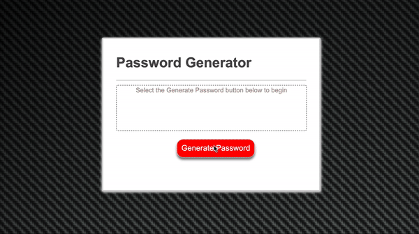

# Password Generator

## How to use
1) Download files
2) Run index.html in browser
3) Click 'Generate Password'
4) Follow prompts and your password will be generated

## Purpose
This program takes in several parameters including length, special characters, numbers, and upper or lowecase letters to create a random password. Once a password has been generated, you can click on redo and it will allow you to try again.

## Demo

## Project Status
The project scope was a lot bigger and started coming across feature creep. I reevaluated and worked on making sure the project was complete and trimmed out some features.

## Reflection
This was a very fun and challenging project to work on because there are so many different ways to tackle it. While I feel like the program is functional and works as intended, I do want to add more features down the road. 

[Demo of Password Generator](https://efrenmarin45.github.io/PasswordGenerator/)

No licenses. Creative purposes only. @Efrenmarin45 on GitHub.
